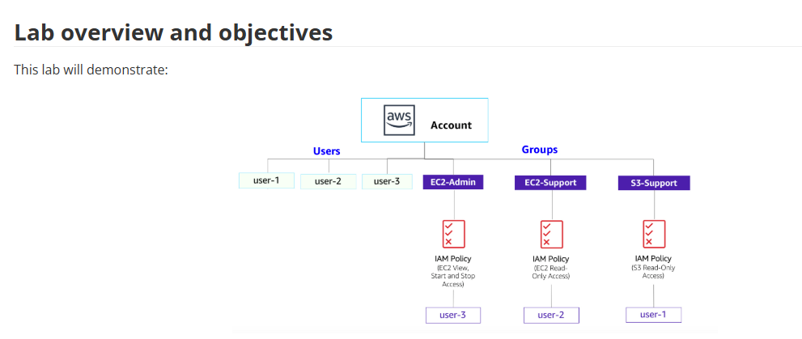
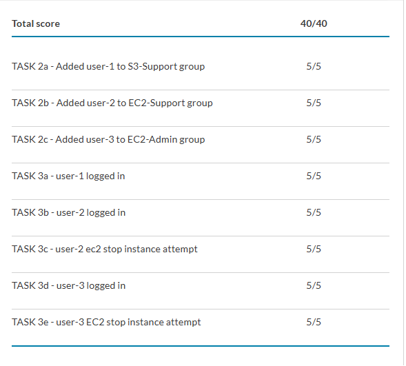

<div align="center">


# Lab 1 — Introduction to AWS IAM

**Identity & Access Management · Users, Groups & Policies · Least Privilege**

`IAM` &nbsp;•&nbsp; `Users & Groups` &nbsp;•&nbsp; `Managed & Inline Policies` &nbsp;•&nbsp; `Least Privilege`

</div>

---

## Overview

AWS Identity and Access Management (IAM) controls **who can do what** in an AWS account. This lab explores pre-created IAM users, groups, and policies, then applies a real-world scenario: granting each user only the access their job requires by placing them in the right group — a hands-on lesson in **least privilege**.

**Duration:** ~40 minutes

### Objectives
- Explore pre-created IAM **users** and **groups**
- Inspect the **policies** attached to each group (managed and inline)
- Add users to groups so they **inherit** the group's permissions
- Locate and use the **IAM sign-in URL**
- Test how policies control access to **Amazon S3** and **Amazon EC2**

---

## Scenario & Architecture

Permissions flow **policy → group → user**. The users hold no direct permissions; they inherit access from their group's attached policy.

<div align="center">
  
  <br/><em>Figure 1 — Three users, three groups, and the policy attached to each.</em>
</div>

| User | Group | Permissions |
|------|-------|-------------|
| `user-1` | `S3-Support` | Read-only access to Amazon S3 |
| `user-2` | `EC2-Support` | Read-only access to Amazon EC2 |
| `user-3` | `EC2-Admin` | View, Start, and Stop Amazon EC2 instances |

---

## Walkthrough

### Task 1 — Explore Users and Groups
Inspect the pre-created identities and their policies.

- `user-1`, `user-2`, `user-3` — each has a console password but **no permissions and no group** yet.
- `EC2-Support` → managed policy `AmazonEC2ReadOnlyAccess` (List/Describe on EC2, ELB, CloudWatch, Auto Scaling).
- `S3-Support` → managed policy `AmazonS3ReadOnlyAccess` (Get/List on S3).
- `EC2-Admin` → an **inline policy** granting Describe + Start/Stop on EC2.

> **Policy anatomy:** every statement has an **Effect** (Allow/Deny), an **Action** (API calls, e.g. `cloudwatch:ListMetrics`), and a **Resource** (scope, e.g. a specific bucket/instance or `*`). Managed policies are reusable and update everywhere at once; inline policies belong to a single identity.

### Task 2 — Add Users to Groups
Grant access by group membership, not per-user.

```text
user-1 → S3-Support
user-2 → EC2-Support
user-3 → EC2-Admin
```
Confirm each group shows **1** in the Users column.

<sub>📷 *Optional screenshot: user groups each showing 1 member.*</sub>

### Task 3 — Sign-In and Test Users
Copy the **IAM sign-in URL** from the Dashboard, open an incognito window, and sign in as each user.

- **user-1 (S3-Support):** can view S3 buckets; EC2 → `You are not authorized to perform this operation`.
- **user-2 (EC2-Support):** can view the `LabHost` instance; **Stop** fails (read-only); S3 → `You don't have permissions to list buckets`.
- **user-3 (EC2-Admin):** selecting `LabHost` → **Stop instance** **succeeds**.

> These three tests prove the policies work as designed: read-only groups can look but not touch, the admin group can act, and access never leaks across services. **Deny-by-default** — nothing is granted unless a policy explicitly allows it.

<sub>📷 *Optional screenshots: user-2 stop denied; user-3 stop succeeds.*</sub>

---

## Key Takeaways

- **Least privilege in practice** — each user gets only the access their role needs.
- **Groups scale access control** — attach the policy once; every member inherits it.
- **Managed vs inline policies** — reusable/central vs bound to a single identity.
- **Effect / Action / Resource** — the anatomy of every policy statement.
- **Deny by default** — no policy means no access; read-only vs admin = Describe vs Start/Stop.
- **Roles & federation** — IAM also supports assumable roles and federated sign-in for cross-account and enterprise SSO.

---

## Lab Result

All graded checks passed — **Total score: 40 / 40**.

<div align="center">
  
  <br/><em>AWS Academy submission report — group membership + permission tests for all three users.</em>
</div>

---

<div align="center">
<sub>

**Atif Memon** · [cloud-security-labs](https://github.com/atifkaloodi1/cloud-security-labs) · [gravatar.com/atifmem](https://gravatar.com/atifmem)

Part of the **CYB 222 — Linux Systems Administration & Security** AWS cloud module.

</sub>
</div>
