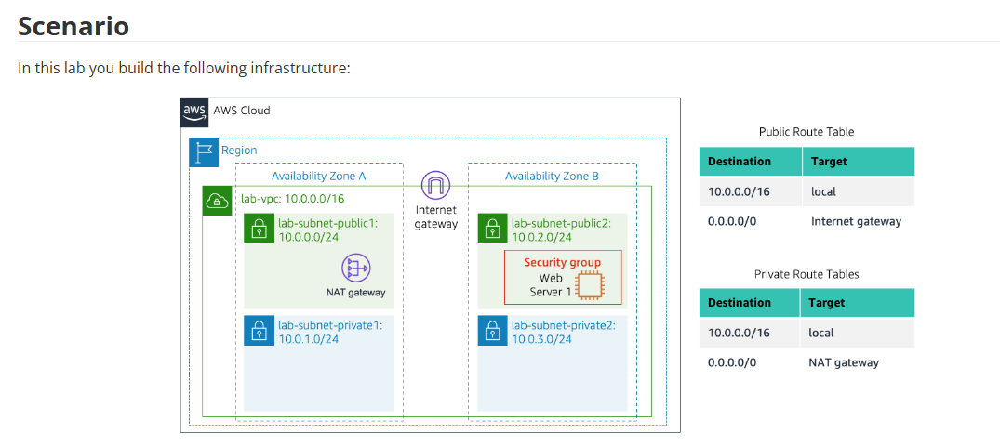
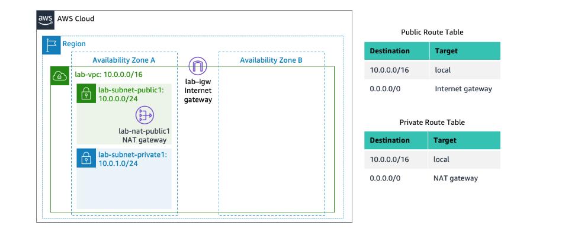
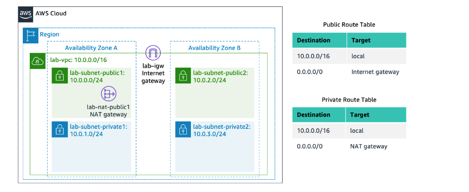
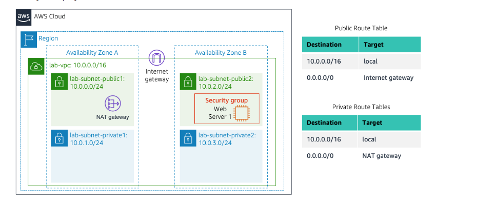
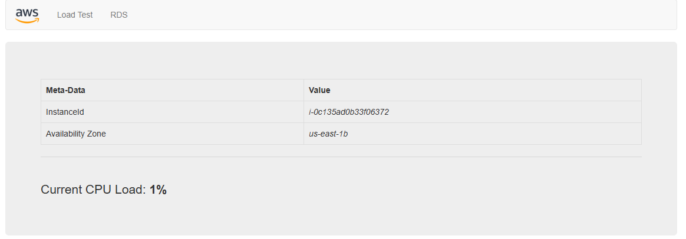
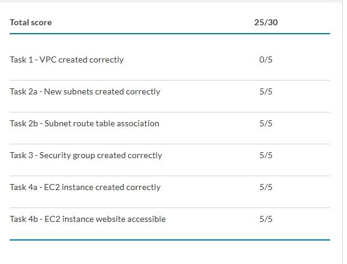

# Lab 2 — Build a VPC and Launch a Web Server on AWS

> Part of [**cloud-security-labs**](../README.md) — a collection of hands-on cloud security labs.

A hands-on lab building a custom, multi-AZ Amazon VPC from the ground up and deploying a public-facing web server into it. This repo documents the full build — the network design, the routing logic that separates public from private subnets, the security group acting as a virtual firewall, and the EC2 instance bootstrapped into a working web server via a user-data script.

> **Context:** Completed as part of a Cyber Security Analyst diploma (cloud security module). The goal here is not just to finish the lab, but to understand *why* each piece is wired the way it is — the same reasoning that applies to designing secure network architecture in production.

---

## Architecture

The finished environment is a single VPC (`10.0.0.0/16`) spanning **two Availability Zones**, each holding one public and one private subnet. An Internet Gateway provides inbound/outbound internet access for the public subnets; a NAT Gateway gives the private subnets *outbound-only* internet access without exposing them directly. A web server runs in a public subnet, protected by a security group that permits only HTTP.



| Component | Value | Purpose |
|---|---|---|
| VPC | `lab-vpc` — `10.0.0.0/16` | Isolated virtual network |
| Public subnet 1 (AZ-A) | `lab-subnet-public1` — `10.0.0.0/24` | Internet-facing resources |
| Private subnet 1 (AZ-A) | `lab-subnet-private1` — `10.0.1.0/24` | Internal resources |
| Public subnet 2 (AZ-B) | `lab-subnet-public2` — `10.0.2.0/24` | Hosts the web server |
| Private subnet 2 (AZ-B) | `lab-subnet-private2` — `10.0.3.0/24` | Internal resources |
| Internet Gateway | `lab-igw` | Public internet access |
| NAT Gateway | `lab-nat-public1` | Outbound-only access for private subnets |
| Security Group | `Web Security Group` | Virtual firewall — permits HTTP |
| EC2 instance | `Web Server 1` (t2.micro, Amazon Linux 2023) | Apache + PHP web server |

**Region:** `us-east-1` (N. Virginia)

---

## Key Concepts

A few ideas do most of the work in this design:

**Public vs. private subnet — it's all in the route table.** A subnet isn't inherently public or private; what makes it public is a route sending `0.0.0.0/0` traffic to the **Internet Gateway**. A private subnet instead routes `0.0.0.0/0` to the **NAT Gateway**, so its resources can reach out (for updates, patches) but can't be reached from the internet.

**Internet Gateway vs. NAT Gateway.** The IGW is bidirectional — resources with public IPs can send and receive traffic to/from the internet. The NAT Gateway is one-directional for the private side: it lets private instances initiate outbound connections while blocking any unsolicited inbound traffic. This is the classic pattern for keeping databases and backend services off the public internet while still letting them pull updates.

**Multi-AZ for high availability.** Placing subnets in two Availability Zones means a failure in one AZ doesn't take the whole environment down. It's the foundation for any HA design on AWS.

**Security group as a stateful firewall.** The security group filters traffic at the instance level. Here it allows only inbound HTTP from anywhere, so the web page is reachable but nothing else is exposed.

---

## Walkthrough

### Task 1 — Create the VPC

Used the **VPC and more** wizard to provision the core network in one action: the VPC, an Internet Gateway, one public and one private subnet in AZ-A, a route table for each, and a NAT Gateway.

Configuration:
- Name tag auto-generation: `lab`
- IPv4 CIDR: `10.0.0.0/16`
- 1 Availability Zone, 1 public + 1 private subnet
- Public subnet CIDR: `10.0.0.0/24`, Private subnet CIDR: `10.0.1.0/24`
- NAT gateways: **In 1 AZ**
- VPC endpoints: **None**
- DNS hostnames and DNS resolution: **enabled**

End state after Task 1 — everything lives in AZ-A:



<!-- SCREENSHOT: VPC "Create VPC" settings panel showing the lab name tag and 10.0.0.0/16 CIDR -->
<!-- screenshots/01-vpc-settings.png -->

<!-- SCREENSHOT: The resource map after clicking "View VPC" (shows subnet -> route table -> gateway wiring) -->
<!-- screenshots/02-vpc-resource-map.png -->

---

### Task 2 — Add Subnets in a Second AZ

Added a second public and private subnet in **AZ-B** to enable high availability, then updated routing so the new subnets behave correctly:

- `lab-subnet-public2` — `10.0.2.0/24`
- `lab-subnet-private2` — `10.0.3.0/24`

The routing work is the important part. I associated:
- **`lab-rtb-public`** with `lab-subnet-public2` → its `0.0.0.0/0 → igw-xxxx` route makes the subnet public.
- **`lab-rtb-private1`** with `lab-subnet-private2` → its `0.0.0.0/0 → nat-xxxx` route gives it outbound-only access.

End state after Task 2 — subnets now span both AZs:



<!-- SCREENSHOT: Subnets list showing all four subnets with their CIDRs (.0.0/24, .1.0/24, .2.0/24, .3.0/24) -->
<!-- screenshots/03-all-subnets.png -->

<!-- SCREENSHOT: lab-rtb-private1 Routes tab showing 0.0.0.0/0 -> nat-xxxx -->
<!-- screenshots/04-private-route-nat.png -->

<!-- SCREENSHOT: lab-rtb-public Routes tab showing 0.0.0.0/0 -> igw-xxxx -->
<!-- screenshots/05-public-route-igw.png -->

---

### Task 3 — Create a Security Group

Created **`Web Security Group`** attached to `lab-vpc`, acting as a virtual firewall for the web server.

Inbound rule:
- **Type:** HTTP
- **Source:** Anywhere-IPv4 (`0.0.0.0/0`)
- **Description:** Permit web requests

<!-- SCREENSHOT: Web Security Group inbound rules showing HTTP / Anywhere-IPv4 -->
<!-- screenshots/06-security-group-inbound.png -->

---

### Task 4 — Launch the Web Server

Launched an EC2 instance configured as a web server:

- **Name:** `Web Server 1`
- **AMI:** Amazon Linux 2023
- **Instance type:** t2.micro
- **Key pair:** vockey
- **Network:** `lab-vpc`
- **Subnet:** `lab-subnet-public2` *(public — so it's reachable)*
- **Auto-assign public IP:** Enabled
- **Security group:** `Web Security Group`
- **User data:** bootstrap script (see [`user-data.sh`](user-data.sh))

The user-data script installs Apache, PHP, and MariaDB, then downloads and deploys a sample PHP app that renders the AWS logo and the instance metadata. It runs automatically on first boot with root privileges.

Final architecture with the web server in place:



<!-- SCREENSHOT: EC2 launch Network settings (lab-vpc, lab-subnet-public2, auto-assign public IP enabled) -->
<!-- screenshots/07-ec2-network-settings.png -->

<!-- SCREENSHOT: The User data script box during launch -->
<!-- screenshots/08-user-data.png -->

<!-- SCREENSHOT: Instance list showing Web Server 1 with 2/2 checks passed -->
<!-- screenshots/09-instance-running.png -->

<!-- SCREENSHOT: Browser showing the AWS logo + instance metadata page (proof it works) -->
<!-- screenshots/10-web-page.png -->

---

## Verification

Pasted the instance's **Public IPv4 DNS** into a browser and confirmed the web application loaded — the AWS logo plus live instance metadata, proving the full path worked end to end: request → Internet Gateway → public subnet → security group → EC2 instance → Apache/PHP.



The metadata confirms the design worked as intended: the page reports **Availability Zone `us-east-1b`** — matching the AZ-B placement of `lab-subnet-public2` — along with the live InstanceId and a real-time CPU load readout, showing the bootstrapped PHP app is fully running.

<!-- SCREENSHOT: Lab grades / Submission Report panel (completion evidence) -->
<!-- screenshots/11-grades.png -->

Final submission scored **25/30**, with full marks on subnet creation, route table associations, the security group, the EC2 instance, and web accessibility. (See [Notes](#notes) below on the Task 1 check.)



---

## Takeaways

- A subnet's "public" or "private" nature is defined entirely by its route table target (IGW vs. NAT), not by the subnet itself.
- The NAT Gateway pattern is how you let private resources reach the internet for patching without ever exposing them to inbound traffic — a core principle of defense in depth.
- Spreading subnets across Availability Zones is the minimum viable step toward a highly available architecture.
- Security groups are stateful, instance-level firewalls; least-privilege here meant allowing only HTTP and nothing more.
- User-data scripts make instance provisioning repeatable and automatable — the same idea that scales up into full infrastructure-as-code.

---

## Notes

The Task 1 check ("VPC created correctly") returned 0/5 while every downstream check — subnets, route associations, security group, EC2, and web accessibility — passed at full marks. Since those later tasks all depend on a working VPC, the deployment itself was clearly functional end to end (confirmed by the live web page). The lost points most likely trace to the grader expecting an exact configuration value from the Task 1 wizard — a common cause being the **name tag**, since the lab specifies changing the auto-generated value from `project` to `lab`, and that value drives every resource name the grader checks for. The lab allows multiple submissions, so the fix is to re-check the Submission Report detail for the specific expected value and resubmit.

*Documenting the miss on purpose — reading a submission report and reasoning about what a grader expected is part of the skill.*

---

## Module Structure

```
lab-02-vpc-web-server/
├── README.md              # This walkthrough
├── user-data.sh           # EC2 bootstrap script (extracted & commented)
├── diagrams/              # Lab reference architecture diagrams
│   ├── 00-architecture-full.png
│   ├── 01-task1-vpc.png
│   ├── 02-task2-subnets.png
│   └── 03-task4-webserver.png
└── screenshots/           # Console captures documenting the build
```

---

*Lab environment provided by AWS Academy. Architecture diagrams are from the lab materials; console screenshots are my own captures from completing the lab.*
