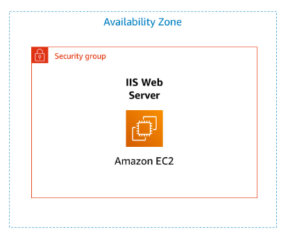
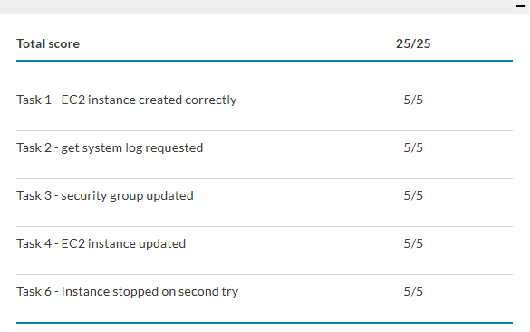

<div align="center">


# Lab 3 — Introduction to Amazon EC2

**Launch · Monitor · Security Groups · Resize · Stop & Termination Protection**

`EC2` &nbsp;•&nbsp; `User Data` &nbsp;•&nbsp; `Security Groups` &nbsp;•&nbsp; `EBS Resize` &nbsp;•&nbsp; `Stop Protection`

</div>

---

## Overview

Amazon EC2 provides resizable compute capacity in the cloud. This lab launches a web server from a **user-data bootstrap script**, monitors it, opens it to HTTP traffic through a **security group**, resizes both the instance and its disk, explores service limits, and exercises the guardrails that prevent accidental **stop and termination**.

**Duration:** ~35 minutes &nbsp;|&nbsp; **Region:** `us-east-1`

### Objectives
- Launch a web server with **termination protection** enabled
- Monitor the instance (status checks, CloudWatch, system log, screenshot)
- Modify the **security group** to allow HTTP (port 80)
- Resize the **instance type** and **EBS volume**; enable **stop protection**
- Explore EC2 **service limits**, then test stop protection and stop the instance

---

## Architecture

A single EC2 instance runs in a public subnet of the Lab VPC, inside a security group acting as its virtual firewall. A user-data script turns it into a working web server on first boot.

<div align="center">
  
  <br/><em>Figure 1 — EC2 web server inside a security group in one Availability Zone.</em>
</div>

> ⚠️ **Correction:** the AWS diagram labels the box **"IIS Web Server,"** but that's inaccurate for this build. IIS is Microsoft's *Windows* web server — this instance runs **Amazon Linux 2023**, and the user-data script installs **Apache (`httpd`)**. The running service is Apache, not IIS.

---

## Walkthrough

### Task 1 — Launch Your EC2 Instance
Launch with termination protection and a user-data bootstrap.

```text
Name:            Web Server        (tag Name = Web Server)
AMI:             Amazon Linux 2023
Instance type:   t2.micro          (1 vCPU, 1 GiB)
Key pair:        vockey
Network:         Lab VPC / PublicSubnet1  (auto-assign public IP)
Security group:  Web Server security group  (remove default inbound rule)
Advanced:        Termination protection = Enable
```

**User data** (runs once, as root, on first boot):
```bash
#!/bin/bash
dnf install -y httpd
systemctl enable httpd
systemctl start httpd
echo '<html><h1>Hello From Your Web Server!</h1></html>' > /var/www/html/index.html
```

<div align="center">
  
  <br/><em>Web Server in the Running state with 2/2 status checks passed.</em>
</div>

### Task 2 — Monitor Your Instance
Status checks, CloudWatch, system log, and instance screenshot.

- **Status checks** tab — System + Instance reachability both pass.
- **Monitoring** tab — CloudWatch metrics (basic 5-min by default; detailed 1-min optional).
- **Get system log** — confirms the `httpd` package installed from user data.
- **Get instance screenshot** — a console screenshot for troubleshooting when SSH/RDP is unavailable.

<div align="center">
  
  <br/><em>System log confirming the httpd package was installed via user data.</em>
  <br/><br/>
  
  <br/><em>Instance console screenshot from Get instance screenshot.</em>
</div>

### Task 3 — Security Group & Web Access
The site is unreachable until port 80 is opened.

Pasting the **Public IPv4** into a browser first **fails** — no inbound rule allows HTTP. Add one:
```text
Type: HTTP   |   Port: 80   |   Source: Anywhere-IPv4 (0.0.0.0/0)
```
Refresh — the page now loads.

<div align="center">
  
  <br/><em>"Hello From Your Web Server!" after adding the HTTP inbound rule.</em>
</div>

> **Security-group-as-firewall:** the server was running the whole time but unreachable because nothing permitted port 80. **Deny-by-default** — access exists only where explicitly allowed.

### Task 4 — Resize the Instance & Volume
Stop the instance (required to resize), then:
```text
Instance type:  t2.micro → t2.small   (2× memory)
Stop protection: Enable
EBS volume:     8 GiB → 10 GiB
```
Start it again — now t2.small with a 10 GiB root volume.

> On stop/start, an instance usually gets a **new public IPv4** but keeps its private IP and all EBS data.

### Task 5 — Explore EC2 Limits *(not graded)*
Service Quotas → Amazon EC2 → search `running on-demand` to view per-region limits on how many/which instance types can run. Account owners can request increases.

### Task 6 — Test Stop Protection
With stop protection on, **Stop** fails:
```text
The instance may not be stopped. Modify its 'disableApiStop' attribute and try again.
```
Disable stop protection → Save → Stop again → **succeeds**.

> **Grader timing:** some checks only credit ~5 minutes after the action. Submitting too early can score a task 0/5 even when done correctly — wait a couple minutes and re-submit. (This is what caught Task 6 on the first attempt; 5/5 on re-submission.)

---

## Key Takeaways

- **Security groups are deny-by-default firewalls** — the site was unreachable until an explicit HTTP:80 rule was added.
- **User data automates secure bootstrapping** — install, enable, start, publish, with no interactive login.
- **Guardrails prevent costly mistakes** — termination and stop protection add deliberate friction against accidental destruction.
- **Know your actual stack** — the diagram said IIS; the box ran Apache on Amazon Linux.
- **Elasticity up and down** — instance type and EBS both resized on demand.
- **Know the limits** — per-region service quotas cap running instances (capacity planning *and* spotting abnormal growth).

---

## Lab Result

All graded checks passed — **Total score: 25 / 25**. (Task 5 has no graded check.)

<div align="center">
  
  <br/><em>AWS Academy submission report — instance, system log, security group, resize, stop protection.</em>
</div>

---

<div align="center">
<sub>

**Atif Memon** · [cloud-security-labs](https://github.com/atifkaloodi1/cloud-security-labs) · [gravatar.com/atifmem](https://gravatar.com/atifmem)

Part of the **CYB 222 — Linux Systems Administration & Security** AWS cloud module.

</sub>
</div>
