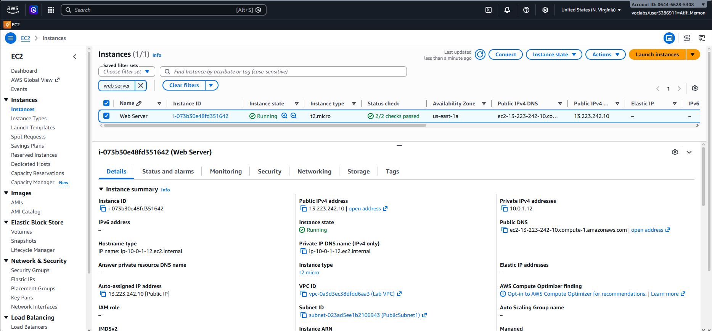
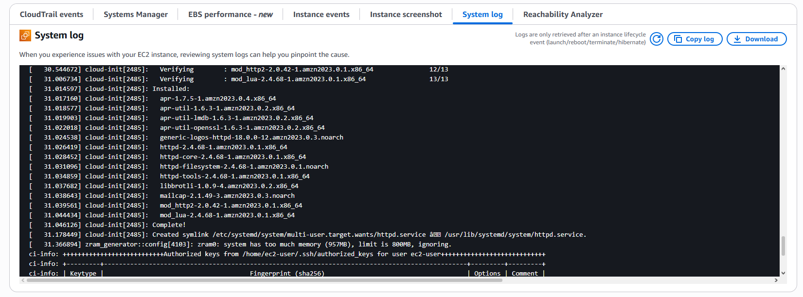
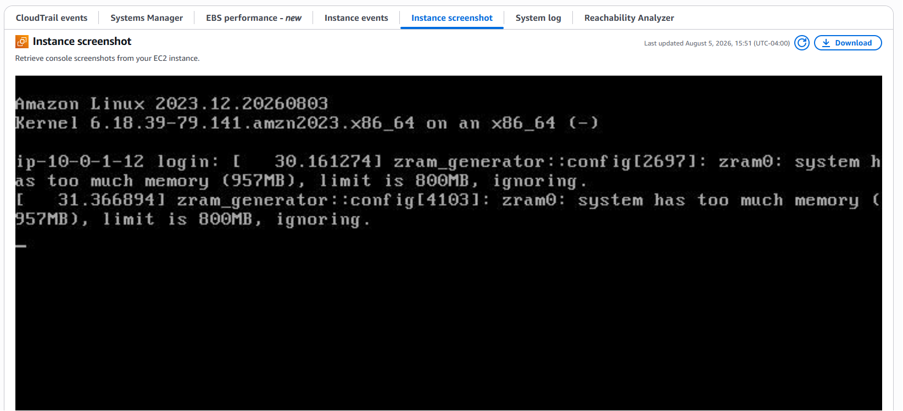
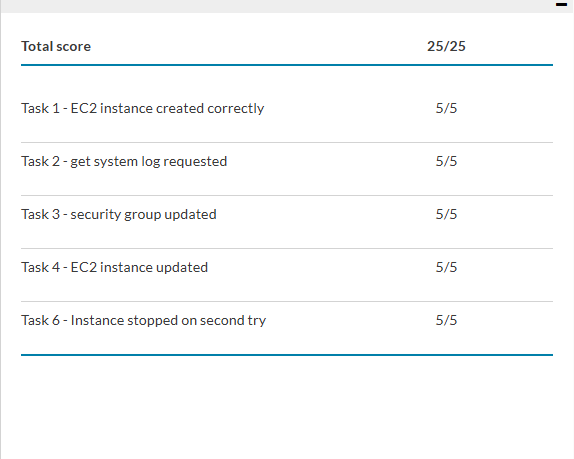

# Lab 3 — Introduction to Amazon EC2

> Part of [**cloud-security-labs**](../README.md) — a collection of hands-on cloud security labs.

A hands-on walkthrough of the Amazon EC2 instance lifecycle: launching a web server with accidental-deletion safeguards, monitoring its health, using a security group to demonstrate firewall behaviour, resizing compute and storage, and testing stop protection. Where Lab 2 focused on the *network* around an instance, this lab focuses on the *instance itself* — how you launch, protect, observe, and resize it.

> **Context:** Completed as part of a Cyber Security Analyst diploma (cloud security module). The security angle here is operational: protecting instances from accidental loss (termination/stop protection), using security groups as least-privilege firewalls, and using logs and console output to verify what a server actually did on boot.

---

## What Gets Built

A single EC2 instance named `Web Server`, running Apache on Amazon Linux 2023, launched into a public subnet of the lab VPC and reachable over HTTP once its security group is opened.

| Setting | Value |
|---|---|
| Instance name | `Web Server` |
| AMI | Amazon Linux 2023 |
| Instance type (initial) | `t2.micro` (1 vCPU, 1 GiB) |
| Instance type (after resize) | `t2.small` (1 vCPU, 2 GiB) |
| Key pair | vockey |
| Network | Lab VPC → `PublicSubnet1` |
| Security group | `Web Server security group` (HTTP inbound) |
| Root volume (initial) | 8 GiB gp3 |
| Root volume (after resize) | 10 GiB gp3 |
| Termination protection | Enabled |
| Stop protection | Enabled (then disabled to test) |
| Region | `us-east-1` (N. Virginia) |

The bootstrap script that installs and starts Apache is in [`user-data.sh`](user-data.sh).

---

## Key Concepts

**Termination & stop protection.** Two independent safeguards against accidental loss. *Termination protection* blocks the instance from being deleted (an irreversible action — the instance and its data are gone). *Stop protection* blocks it from being stopped. Both are attributes you can toggle; while enabled, the corresponding action fails with a `disableApiStop` / `disableApiTermination` error until you explicitly turn the guard off. This is a simple but real operational control — protecting critical instances from a fat-fingered console click.

**Security group as a firewall — demonstrated, not just described.** This lab deliberately launches the instance with an *empty* inbound rule set, so the web page is unreachable at first even though Apache is running. Adding a single HTTP rule (port 80, from anywhere) is what makes it reachable. The point is to *see* the firewall doing its job: the server was fine the whole time; only the security group stood between it and the browser.

**User data = automated provisioning.** The instance installs and configures Apache with no manual SSH login, via a boot-time script. This is the seed of infrastructure-as-code — repeatable, hands-off setup.

**Stop vs. terminate (and what persists).** Stopping an instance shuts it down with no compute charge, but EBS storage is retained and charges continue. On restart it typically moves to a new host and gets a **new public IP**, but keeps its **private IP** and all EBS data. Terminating deletes the instance entirely. Resizing requires a stop first, because you can't change the hardware profile of a running instance.

**Monitoring & console visibility.** Status checks (system reachability + instance reachability), CloudWatch metrics, the **system log**, and the **instance screenshot** together let you verify health and diagnose problems even when you can't SSH in.

---

## Walkthrough

### Task 1 — Launch the Instance (with protection)

Launched `Web Server` (Amazon Linux 2023, t2.micro) into `PublicSubnet1` of the Lab VPC, with a public IP auto-assigned. During launch:

- Created `Web Server security group` and **removed the default inbound rule** — deliberately leaving the instance unreachable, to be fixed in Task 3.
- Enabled **termination protection** under Advanced details.
- Pasted the Apache bootstrap script into User data (see [`user-data.sh`](user-data.sh)).

Instance reached **Running** with **2/2 status checks passed**:



The Details pane confirms the placement: `Lab VPC`, `PublicSubnet1`, a public IP (`13.223.242.10`) for internet reachability, and a retained private IP (`10.0.1.12`).

---

### Task 2 — Monitor the Instance

Explored several ways to observe instance health without logging in:

- **Status checks** — both system reachability and instance reachability passed.
- **Monitoring tab** — CloudWatch metrics (basic 5-minute monitoring on by default).
- **System log** — console output confirming the bootstrap ran. The log shows the `httpd` packages being installed by cloud-init, ending in `Complete!` — proof the user-data script executed on first boot.



- **Instance screenshot** — what the instance console would show if a screen were attached. Useful for diagnosing a host you can't reach over SSH/RDP.



---

### Task 3 — Open the Security Group and Access the Server

First hit the instance's public IP in a browser — it **failed to load**, even though Apache was running. That's the security group doing its job: with no inbound rule, port 80 traffic is blocked.

Fixed it by editing `Web Server security group` and adding one inbound rule:
- **Type:** HTTP
- **Source:** Anywhere-IPv4

Refreshed the browser and the page loaded:


This is the whole security-group lesson in one before/after: the only thing that changed was a single firewall rule.

---

### Task 4 — Resize the Instance and Enable Stop Protection

Scaling requires a stop first, since hardware can't change on a running instance.

- **Stopped** the instance (no compute charge while stopped; EBS charges continue).
- Changed instance type `t2.micro → t2.small` (doubling memory to 2 GiB).
- Enabled **stop protection**.
- Resized the root EBS volume `8 GiB → 10 GiB`.
- **Started** the instance again — now with more memory and disk. (Note: on restart it received a new public IP but kept its private IP and all data.)

<!-- SCREENSHOT: Change instance type dialog showing t2.small -->
<!-- screenshots/06-resize-type.png -->

<!-- SCREENSHOT: Modify volume dialog showing 10 GiB -->
<!-- screenshots/07-resize-volume.png -->

---

### Task 5 — Explore EC2 Limits

Opened **Service Quotas → Amazon EC2** and filtered on "running on-demand" to review per-region instance limits. AWS enforces default limits on the number and type of On-Demand instances per region; account owners can request increases. A launch that would exceed the current limit is rejected — worth knowing before scaling out.

<!-- SCREENSHOT: Service Quotas filtered on running on-demand -->
<!-- screenshots/08-service-quotas.png -->

---

### Task 6 — Test Stop Protection

With stop protection enabled, attempting to stop the instance **failed** with:

> Failed to stop the instance — the instance may not be stopped. Modify its `disableApiStop` instance attribute and try again.

That error *is* the safeguard working. To actually stop the instance, disabled stop protection (Actions → Instance settings → Change stop protection → uncheck Enable), then stopped it successfully.

<!-- SCREENSHOT: The "Failed to stop... disableApiStop" error message -->
<!-- screenshots/09-stop-protection-error.png -->

<!-- SCREENSHOT: Instance in Stopped state after disabling protection -->
<!-- screenshots/10-instance-stopped.png -->

---

## Result

Final submission scored **25/25** — full marks across all six tasks: instance creation, system-log monitoring, the security group update, the resize, and stop-protection testing.



---

## Notes

The Task 6 check ("Instance stopped on second try") initially came back 0/5 on the first submission — not because the stop-protection workflow was wrong (the protection triggered, was disabled, and the instance was stopped correctly), but because the lab was submitted before the instance had fully reached the **Stopped** state. AWS Academy's grader only credits some checks once ~5 minutes have passed since the action, and a stop transition (`stopping → stopped`) takes time. After confirming the instance showed **Stopped** and waiting out the grader's delay window, a resubmit brought the score to a full **25/25**.

*Lesson logged for future labs: always confirm the target end-state and wait out the grader's ~5-minute delay window before submitting.*

---

## Module Structure

```
lab-03-ec2-intro/
├── README.md              # This walkthrough
├── user-data.sh           # EC2 bootstrap script (Apache/httpd)
├── diagrams/              # (reserved for reference diagrams)
└── screenshots/           # Console captures documenting the build
```

---

*Lab environment provided by AWS Academy. Console screenshots are my own captures from completing the lab.*
