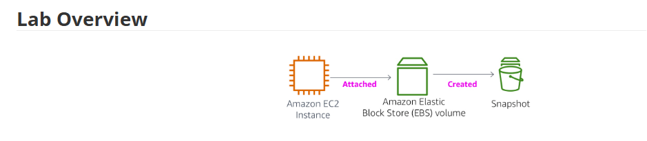
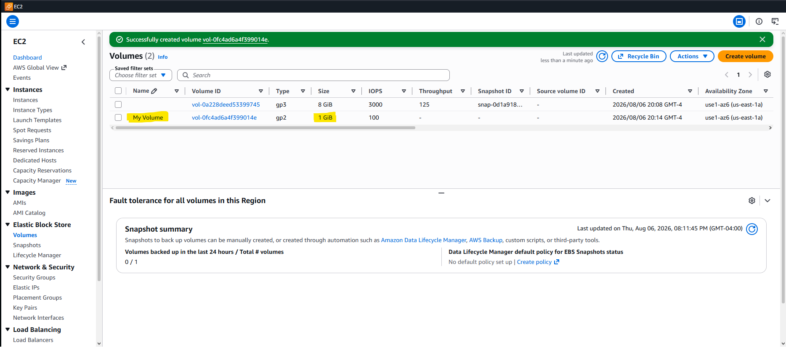
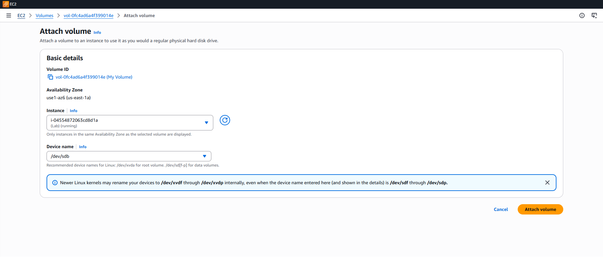
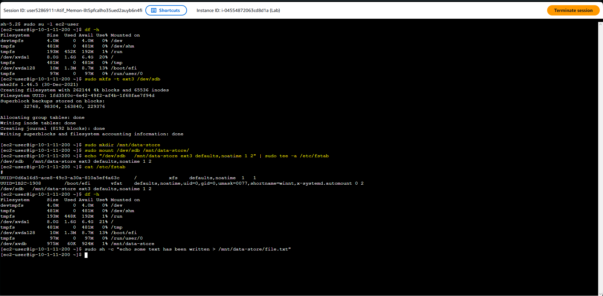
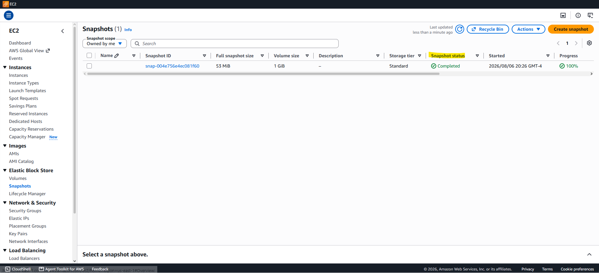
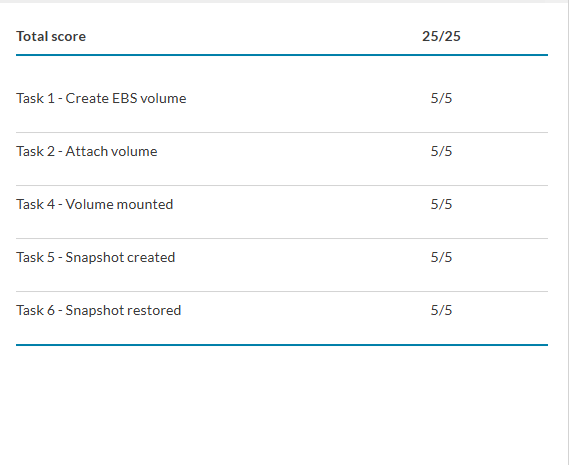

# Lab 4 — Working with Amazon EBS

> Part of [**cloud-security-labs**](../README.md) — a collection of hands-on cloud security labs.

A hands-on walkthrough of Amazon Elastic Block Store (EBS): creating a block volume, attaching it to an EC2 instance, formatting and mounting it as a Linux file system, and then completing a full **backup-and-recovery cycle** with a snapshot — write a file, snapshot the volume, delete the file, and restore it from the snapshot onto a new volume. Where Lab 3 covered the instance itself, this lab covers the **persistent storage** that lives independently of it.

> **Context:** Completed as part of a Cyber Security Analyst diploma (cloud security module). The security angle here is **data durability and recovery** — snapshots as a point-in-time backup mechanism, and the resilience that comes from storage persisting independently of compute.

---

## What Gets Built

A 1 GiB EBS volume attached to a pre-provisioned EC2 instance, formatted as ext3 and mounted, then backed up via snapshot and restored to a second volume.

| Item | Value |
|---|---|
| EC2 instance | `Lab` (pre-provisioned) |
| New volume | `My Volume` — 1 GiB, General Purpose SSD (gp2) |
| File system | ext3, mounted at `/mnt/data-store` |
| Attach point (original) | `/dev/sdb` (appears as `/dev/xvdb` in Linux) |
| Snapshot | `My Snapshot` (stored in S3, replicated across AZs) |
| Restored volume | `Restored Volume` (created from snapshot) |
| Attach point (restored) | `/dev/sdc`, mounted at `/mnt/data-store2` |
| Region | `us-east-1` (N. Virginia) |

The full terminal command sequence is in [`commands.sh`](commands.sh).

---

## Lab Overview



The flow: an **EC2 instance** has an **EBS volume** attached, and a **snapshot** is created from that volume as a durable, point-in-time backup.

---

## Key Concepts

**EBS volumes are network-attached and persist independently of the instance.** A volume is not part of the instance — it's a separate block device attached over the network. Stop or terminate the instance and the volume (and its data) can survive. This separation of compute and storage is what makes stateful workloads durable on EC2.

**Snapshots are point-in-time backups stored in S3.** A snapshot captures the volume's state and is stored in Amazon S3, **replicated across multiple Availability Zones** — making it *more* durable than the source volume, which is replicated only within a single AZ. Snapshots are incremental: only changed blocks are stored, so empty blocks cost nothing. A new volume can be created from a snapshot at any time — for backup restore, cloning, or moving data between AZs.

**Availability Zone binding.** An EBS volume can only be attached to an instance **in the same Availability Zone**. This is why both the original and restored volumes must be created in the instance's AZ. Snapshots break this constraint: because a snapshot lives in S3 (multi-AZ), you can restore it into a *different* AZ — one of the main ways to migrate an EBS volume across zones.

**Device name remapping.** The volume is attached in the console as `/dev/sdb`, but Amazon Linux presents it as `/dev/xvdb`. Same physical device, different kernel label — worth knowing so `df -h` output doesn't cause confusion.

**Persisting the mount.** Mounting with `mount` is temporary and lost on reboot. Adding the volume to `/etc/fstab` makes the mount persistent across restarts — standard Linux administration applied to a cloud block device.

---

## Walkthrough

### Task 1 — Create an EBS Volume

Created `My Volume` — 1 GiB, General Purpose SSD (gp2), in the **same Availability Zone** as the `Lab` instance (critical — a volume can only attach within its own AZ). The 1 GiB size makes it easy to distinguish from the instance's existing 8 GiB root volume.



Both volumes sit in `use1-az6 (us-east-1a)` — the new 1 GiB gp2 volume alongside the 8 GiB gp3 root volume.

---

### Task 2 — Attach the Volume

Attached `My Volume` to the `Lab` instance at device `/dev/sdb`. Volume state moved to **In-use**.



The attach dialog confirms same-AZ binding ("Only instances in the same Availability Zone as the selected volume are displayed") and even notes that newer Linux kernels may rename `/dev/sdf`–`/dev/sdp` to `/dev/xvdf`–`/dev/xvdp` internally — the remapping seen in the next task.

---

### Task 3 — Connect via Session Manager

Connected to the `Lab` instance using **Session Manager** (no SSH key or open inbound port required — access is brokered through the AWS API), then switched to the ec2-user home directory.

---

### Task 4 — Create and Mount the File System

The core Linux administration steps (full sequence in [`commands.sh`](commands.sh)):

1. `df -h` — confirmed only the 8 GB root volume was mounted; the new volume isn't usable until formatted and mounted.
2. `sudo mkfs -t ext3 /dev/sdb` — created an ext3 file system on the raw volume.
3. `sudo mkdir /mnt/data-store` + `sudo mount /dev/sdb /mnt/data-store` — mounted it.
4. Appended an entry to `/etc/fstab` so the mount **persists across reboots**.
5. `df -h` again — now shows `/dev/xvdb` mounted at `/mnt/data-store`.
6. Wrote a test file and verified its contents:
   `echo some text has been written > /mnt/data-store/file.txt`



The full sequence in one session: `df -h` before (root volume only), `mkfs -t ext3` creating the file system, the mount, the `/etc/fstab` entry for persistence, `df -h` after showing **`/dev/xvdb` mounted at `/mnt/data-store`** (note the `sdb → xvdb` remapping), and the test file written.

---

### Task 5 — Create a Snapshot (and delete the file)

Created `My Snapshot` from `My Volume` — a point-in-time backup stored in S3. Once it reached **Completed**, deleted the test file from the live volume to simulate data loss:

```
sudo rm /mnt/data-store/file.txt
ls /mnt/data-store/     # confirms the file is gone
```



`My Snapshot` reached **Completed** (100%). Note the full snapshot size is only 53 MiB despite the 1 GiB volume — snapshots are incremental and only store used blocks, not empty space.

---

### Task 6 — Restore from Snapshot

The recovery — and the payoff of the whole lab:

1. Created `Restored Volume` from `My Snapshot` (same AZ as the instance).
2. Attached it at `/dev/sdc`.
3. Mounted it at `/mnt/data-store2`.
4. Listed the contents — **`file.txt` is back**, recovered from the snapshot even though it was deleted from the original volume.

```
sudo mkdir /mnt/data-store2
sudo mount /dev/sdc /mnt/data-store2
ls /mnt/data-store2/           # file.txt is present again
cat /mnt/data-store2/file.txt  # "some text has been written"
```

<!-- SCREENSHOT: Restored Volume attached at /dev/sdc -->
<!-- screenshots/08-restored-volume.png -->

<!-- SCREENSHOT: ls /mnt/data-store2/ showing file.txt recovered (the money shot) -->
<!-- screenshots/09-file-restored.png -->

---

## Result

Final submission scored **25/25** — full marks across all five graded tasks: volume creation, attach, mount, snapshot creation, and snapshot restore.



---

## Takeaways

- EBS volumes are **network-attached and persist independently** of the instance — the separation of compute and storage is what makes EC2 workloads durable.
- **Snapshots are the backup mechanism**: point-in-time, incremental, stored in S3, and replicated across AZs — more durable than the source volume itself.
- A volume attaches only **within its own AZ**; restoring from a snapshot is how you move data across AZs.
- The delete → restore cycle is a working demonstration of **backup and recovery** — the core resilience story for block storage.
- Formatting (`mkfs`), mounting, and `/etc/fstab` persistence are standard Linux admin skills applied directly to cloud storage.

---

## Notes

Clean **25/25 on the first submission** — the timing lesson from earlier labs paid off: confirmed the final state of all resources (snapshot Completed, restored volume mounted with `file.txt` present) and waited before submitting, so the AWS Academy grader credited every check on the first try.

---

## Module Structure

```
lab-04-ebs-volumes/
├── README.md              # This walkthrough
├── commands.sh            # Terminal command reference (format, mount, snapshot verify)
├── diagrams/              # Lab reference diagram
│   └── 00-lab-overview.png
└── screenshots/           # Console & terminal captures documenting the build
```

---

*Lab environment provided by AWS Academy. Console and terminal screenshots are my own captures from completing the lab.*
