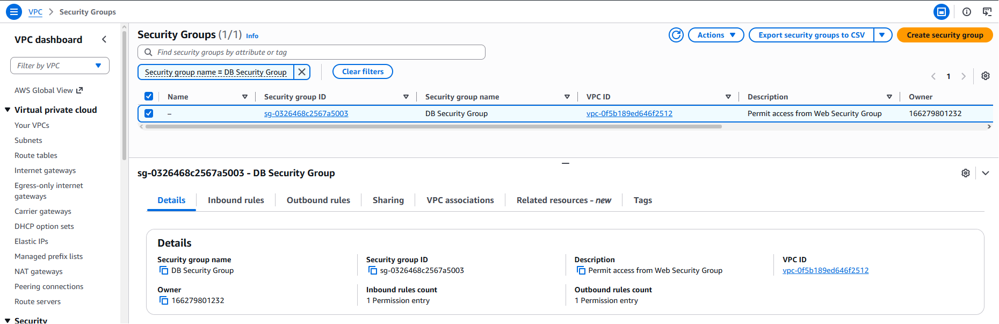
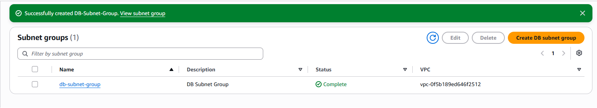
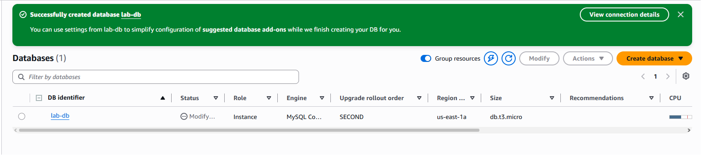
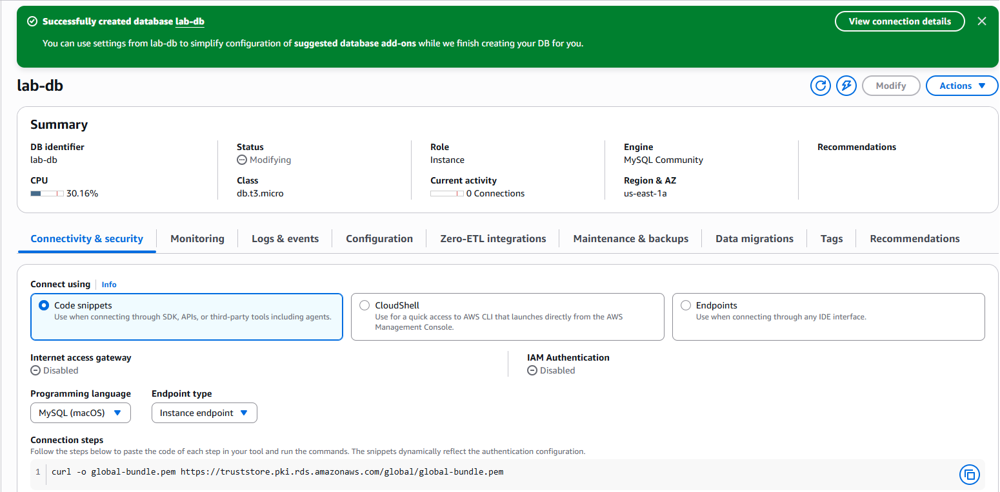
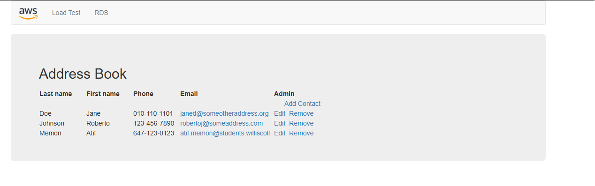
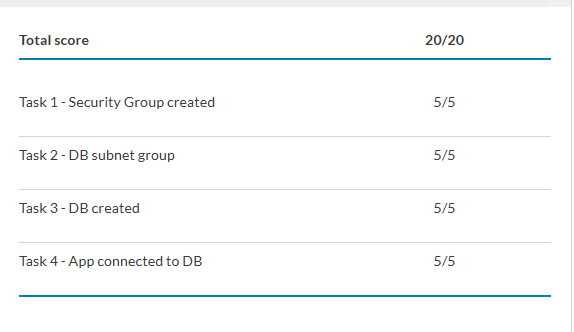

# Lab 5 — Build Your DB Server and Interact With Your DB Using an App

> **Module:** AWS Cloud Security Labs · CYB 222 (Linux Systems Administration & Security)
> **Service focus:** Amazon RDS (MySQL, Multi-AZ) · VPC Security Groups · DB Subnet Groups
> **Result:** 20/20 — all four tasks 5/5 ✅

---

## Objective

Provision an **AWS-managed relational database** (Amazon RDS for MySQL) with **Multi-AZ high availability**, lock it down so only the web tier can reach it, and drive it from a live web application to confirm data persistence and cross-AZ replication.

By the end of the lab I could:

- Launch a Multi-AZ Amazon RDS DB instance.
- Configure the instance to accept connections **only** from the web server's security group.
- Connect a running web app to the database and perform live CRUD operations.

---

## Architecture

**Starting state** — a single-tier setup: a public web server, NAT gateway, internet gateway, and empty private subnets across two Availability Zones.

**End state** — a two-tier, highly available design. The web server in AZ-B talks to an **RDS master** in AZ-A's private subnet, which synchronously replicates to an **RDS standby** in AZ-B's private subnet.

```
Internet
   │
   ▼
Internet Gateway
   │
┌──────────────────── VPC 10.0.0.0/16 ──────────────────────┐
│                                                           │
│   AZ-A (us-east-1a)            AZ-B (us-east-1b)           │
│  ┌───────────────────┐       ┌───────────────────┐        │
│  │ Public 10.0.0.0/24│       │ Public 10.0.2.0/24│        │
│  │   NAT Gateway     │       │  [Web SG] WebServer│───┐   │
│  └───────────────────┘       └───────────────────┘   │   │
│  ┌───────────────────┐       ┌───────────────────┐   │   │
│  │Private 10.0.1.0/24│       │Private 10.0.3.0/24│   │3306
│  │ [DB SG] RDS master│◄─sync─►│ [DB SG] RDS standby│◄─┘   │
│  └───────────────────┘       └───────────────────┘        │
└───────────────────────────────────────────────────────────┘
```

| Component        | AZ         | Subnet         | CIDR          |
|------------------|------------|----------------|---------------|
| NAT Gateway      | us-east-1a | Public subnet 1 | 10.0.0.0/24  |
| Web Server       | us-east-1b | Public subnet 2 | 10.0.2.0/24  |
| RDS master       | us-east-1a | Private subnet 1| 10.0.1.0/24  |
| RDS standby      | us-east-1b | Private subnet 2| 10.0.3.0/24  |

---

## Task 1 — Create the DB Security Group

Created a security group to gate access to the database instance.

| Setting       | Value                                   |
|---------------|-----------------------------------------|
| Name          | `DB Security Group`                     |
| Description   | `Permit access from Web Security Group` |
| VPC           | Lab VPC                                 |
| Inbound rule  | MySQL/Aurora **TCP 3306**               |
| Source        | **Web Security Group** (`sg-…`)         |

**Key security concept — security-group chaining.** The inbound source is *another security group*, not a CIDR block. Only instances that belong to the **Web Security Group** can reach port 3306, regardless of their IP address. This is the least-privilege, identity-based firewall pattern AWS recommends for tiered apps — no hardcoded IPs to maintain, and the rule keeps working even as web instances are replaced or scaled.



---

## Task 2 — Create the DB Subnet Group

A DB subnet group tells RDS which subnets it may deploy into. Multi-AZ requires subnets in **at least two Availability Zones**.

| Setting            | Value                                    |
|--------------------|------------------------------------------|
| Name               | `DB-Subnet-Group`                        |
| Description        | `DB Subnet Group`                        |
| VPC                | Lab VPC                                  |
| Availability Zones | us-east-1a, us-east-1b                   |
| Subnets            | 10.0.1.0/24 (private), 10.0.3.0/24 (private) |

Both selected subnets are **private** — the database never has a public-facing path. This satisfies the Multi-AZ two-AZ minimum while keeping the data tier fully isolated from the internet.



---

## Task 3 — Create the Amazon RDS DB Instance

Launched a **Multi-AZ MySQL** instance for the data tier.

| Setting                | Value                        |
|------------------------|------------------------------|
| Engine                 | MySQL (Community)            |
| Template               | Dev/Test                     |
| Availability           | **Multi-AZ DB instance**     |
| DB instance identifier | `lab-db`                     |
| Master username        | `main`                       |
| Instance class         | Burstable — `db.t3.micro`    |
| Storage                | General Purpose SSD, 20 GB   |
| VPC                    | Lab VPC                      |
| Security group         | DB Security Group (default removed) |
| Enhanced monitoring    | Disabled                     |
| Initial database name  | `lab`                        |
| Automatic backups      | Disabled *(lab speed only)*  |
| Encryption             | Disabled *(lab speed only)*  |

> ⚠️ **Gotcha:** leaving **Enhanced monitoring** enabled triggers an `iam:CreateRole` authorization error in the restricted lab account. Disabling it avoids the failure.

After ~4 minutes the instance reached **Available**, deployed across two AZs. Copied the endpoint (`lab-db.xxxx.us-east-1.rds.amazonaws.com`) for the app config step.





---

## Task 4 — Connect the App and Interact With the Database

Opened the web server by its public IP, went to the **RDS** tab, and pointed the app at the database:

| Field    | Value                                            |
|----------|--------------------------------------------------|
| Endpoint | `lab-db.xxxx.us-east-1.rds.amazonaws.com`        |
| Database | `lab`                                            |
| Username | `main`                                           |
| Password | `********`                                        |

The app initialized the schema and rendered the **Address Book**. I added, edited, and removed contacts — each change persisted to the RDS master and replicated synchronously to the standby in AZ-B.



---

## Result

| Task | Description               | Score |
|------|---------------------------|-------|
| 1    | Security Group created    | 5/5   |
| 2    | DB subnet group           | 5/5   |
| 3    | DB created                | 5/5   |
| 4    | App connected to DB       | 5/5   |
| **Total** |                      | **20/20** |



---

## Key Takeaways

- **Multi-AZ ≠ read replica.** The standby is a *synchronous* copy for failover and durability — it is **not** readable and does **not** scale read traffic. A read replica (asynchronous, readable) is the tool for read scaling. This distinction is a common exam trap.
- **Security-group chaining** enforces least privilege at the network layer: the data tier trusts an *identity* (the Web SG), not an IP range, so the rule survives instance churn and auto-scaling.
- **Private-subnet placement** keeps the database with no public route — defense in depth beyond the SG rule.
- **Shared responsibility shift.** With RDS, AWS owns OS patching, MySQL engine patching, and the replication mechanics. I own the SG rules, master credentials, encryption choice, and the `lab` schema. Contrast with the EC2 web server, where the guest OS is also my responsibility.
- **Backups and encryption were disabled for lab speed only** — both would be mandatory in any production deployment.

---

*Part of the [`cloud-security-labs`](https://github.com/atifkaloodi1/cloud-security-labs) portfolio — hands-on AWS security labs completed during the Cyber Security Analyst Diploma at Willis College.*
