<!-- ============================================================= -->
<div align="center">


# Lab 6 — Scale and Load Balance Your Architecture

**Elastic Load Balancing · EC2 Auto Scaling · Launch Templates · CloudWatch Alarms**

`Elastic Load Balancing` &nbsp;•&nbsp; `Auto Scaling` &nbsp;•&nbsp; `AMI` &nbsp;•&nbsp; `CloudWatch` &nbsp;•&nbsp; `High Availability`

</div>

---

## Overview

This lab converts a single-server web application into a **highly available, elastic** architecture using **Elastic Load Balancing (ELB)** and **EC2 Auto Scaling**. Traffic is distributed across multiple EC2 instances in two Availability Zones, and the fleet scales in and out automatically based on CPU load measured by **Amazon CloudWatch**.

**Duration:** ~30 minutes &nbsp;|&nbsp; **Region:** `us-west-2`

### Objectives
- Create an **Amazon Machine Image (AMI)** from a running instance
- Create an **Application Load Balancer** with a target group
- Create a **launch template** and an **Auto Scaling group**
- Automatically **scale instances** in and out based on demand
- Create **CloudWatch alarms** and monitor infrastructure performance

> ⚠️ **Lab guardrail:** Never run 20+ concurrent instances in this environment — it deactivates the account and deletes all resources. The Auto Scaling group here is capped at a **maximum of 6**.

---

## Architecture

### Starting state
A single **Web Server 1** in Public Subnet 2 (AZ-B), a Multi-AZ RDS database in the private subnets, and a NAT gateway in Public Subnet 1 — with a single point of failure at the web tier.

<div align="center">
  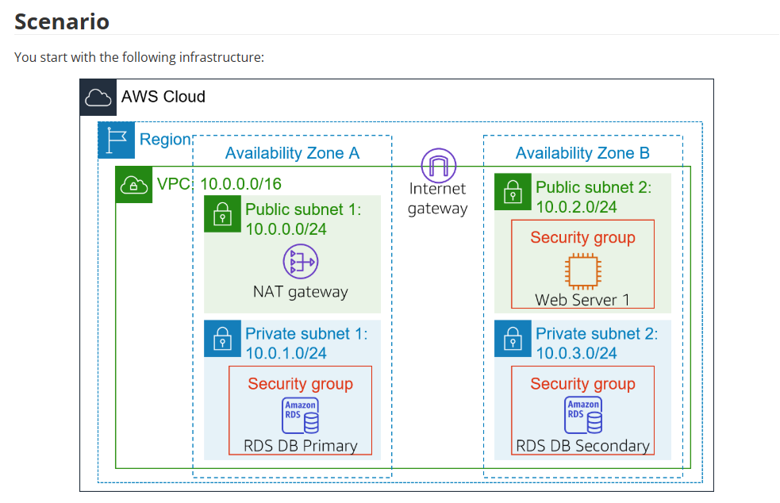
  <br/><em>Figure 1 — Starting infrastructure: one web server, no load balancing.</em>
</div>

### Final state
An internet-facing **Application Load Balancer** across both public subnets fronting an **Auto Scaling group** of private web instances spanning both AZs.

<div align="center">
  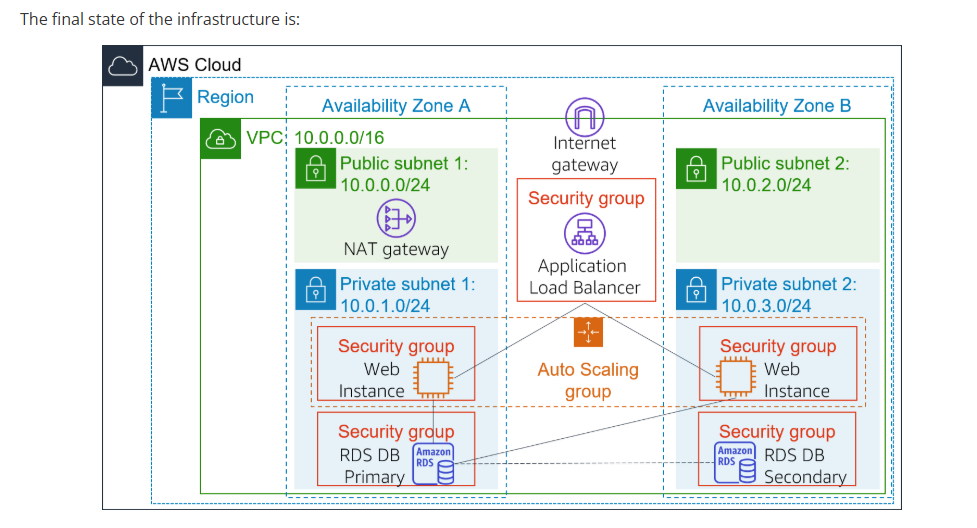
  <br/><em>Figure 2 — Final infrastructure: ALB + Auto Scaling group across two AZs.</em>
</div>

> 🔐 **Security insight:** Only the load balancer's security group is internet-facing. Scaled instances live in private subnets and never receive a public IP — the compute tier is isolated from direct inbound traffic while staying resilient to instance or AZ failure.

---

## Walkthrough

### Task 1 — Create an AMI for Auto Scaling
Capture the boot disk of Web Server 1 so identical instances can be launched.

```text
Image name:        WebServerAMI
Image description: Lab AMI for Web Server
```
`EC2 → Instances → select Web Server 1 → Actions → Image and templates → Create image`

<div align="center">
  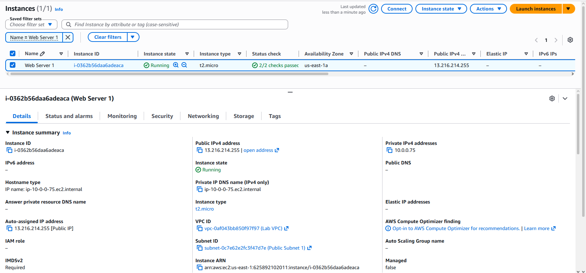
  <br/><em>Web Server 1 running with 2/2 status checks passed — t2.micro in us-east-1a, Lab VPC / Public Subnet 1.</em>
  <br/><br/>
  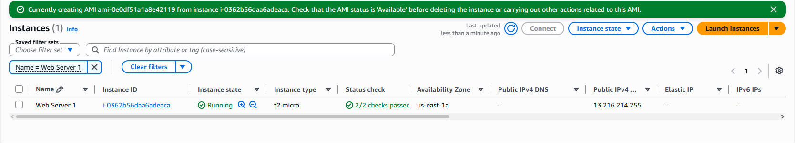
  <br/><em>Confirmation banner: AMI <code>ami-0e0df51a1a8e42119</code> (WebServerAMI) being created from instance <code>i-0362b56daa6adeaca</code>.</em>
</div>

### Task 2 — Create a Load Balancer

**Target group**
```text
Target type: Instances   |   Name: LabGroup   |   VPC: Lab VPC
```

<div align="center">
  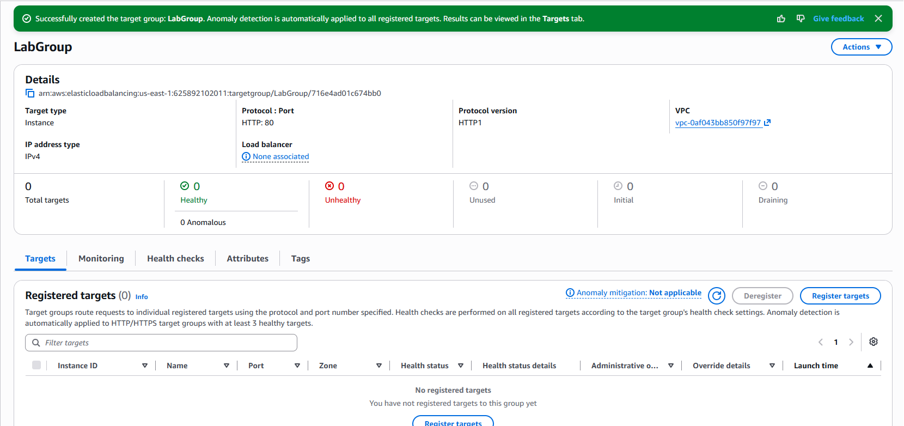
  <br/><em>LabGroup created — target type Instance, HTTP:80, in Lab VPC, 0 registered targets (none yet).</em>
</div>

**Application Load Balancer**
```text
Name:            LabELB           (internet-facing)
Subnets:         Public Subnet 1 (AZ-A) + Public Subnet 2 (AZ-B)
Security group:  Web Security Group   (remove default)
Listener:        HTTP:80 → forward to LabGroup
```

<div align="center">
  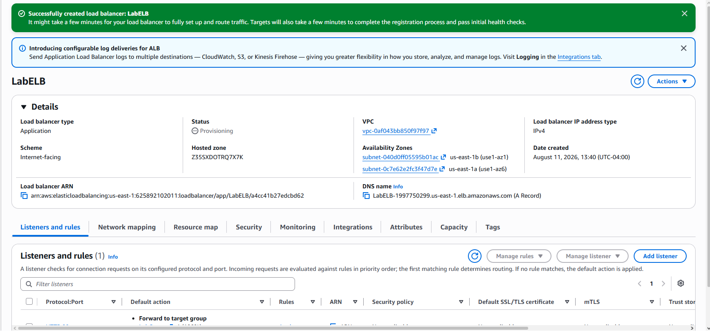
  <br/><em>LabELB created — Application LB, scheme Internet-facing, spanning two AZs in Lab VPC. DNS: <code>LabELB-1997750299.us-east-1.elb.amazonaws.com</code>.</em>
</div>


### Task 3 — Launch Template & Auto Scaling Group

**Launch template — `LabConfig`**
```text
AMI (My AMIs):   WebServerAMI
Instance type:   t2.micro
Key pair:        vockey
Security group:  Web Security Group
Advanced:        Detailed CloudWatch monitoring = Enable
```

<div align="center">
  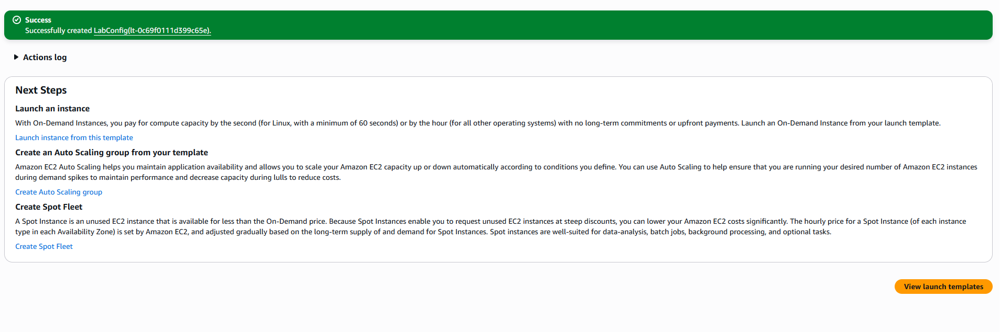
  <br/><em>LabConfig launch template created (<code>lt-0c69f0111d399c65e</code>) — the blueprint the Auto Scaling group uses to launch identical instances.</em>
</div>


**Auto Scaling group — `Lab Auto Scaling Group`**
```text
Subnets:         Private Subnet 1 + Private Subnet 2
Target group:    LabGroup   (+ group metrics collection enabled)
Capacity:        desired 2 | min 2 | max 6
Scaling policy:  LabScalingPolicy  (Target tracking)
Metric / target: Average CPU Utilization @ 60%
Tag:             Name = Lab Instance
```

<div align="center">
  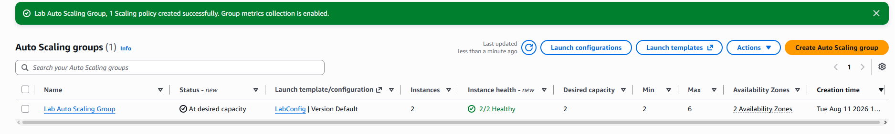
  <br/><em>Lab Auto Scaling Group — At desired capacity, LabConfig, 2 instances 2/2 healthy across 2 AZs (desired 2 / min 2 / max 6), 1 scaling policy, group metrics enabled.</em>
</div>

### Task 4 — Verify Load Balancing
Two `Lab Instance` instances launch; both must show **healthy** in the `LabGroup` target group. Copy the ALB DNS name and open it in a browser:

<div align="center">
  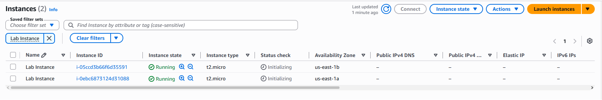
  <br/><em>Two Lab Instance instances launched by Auto Scaling — one in us-east-1a, one in us-east-1b (status checks initializing).</em>
</div>


```text
LabELB-1997750299.us-east-1.elb.amazonaws.com
```

<div align="center">
  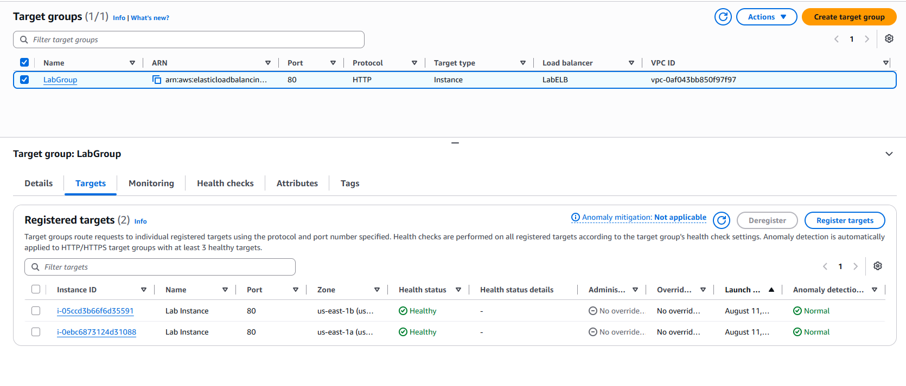
  <br/><em>LabGroup Targets tab — both Lab Instances registered on HTTP:80, Health status = Healthy across both AZs.</em>
</div>

<div align="center">
  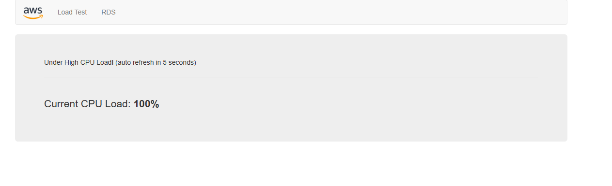
  <br/><em>The app served through <code>LabELB-1997750299.us-east-1.elb.amazonaws.com</code> — proof the ALB routed the request to a healthy backend instance (shown under Load Test at 100% CPU).</em>
</div>

### Task 5 — Test Auto Scaling
Choose **Load Test** in the app to drive CPU up. Within ~5 min the `AlarmHigh` CloudWatch alarm enters **In alarm** once CPU holds above 60% for ~3 min, and Auto Scaling adds instances (up to 6).

<div align="center">
  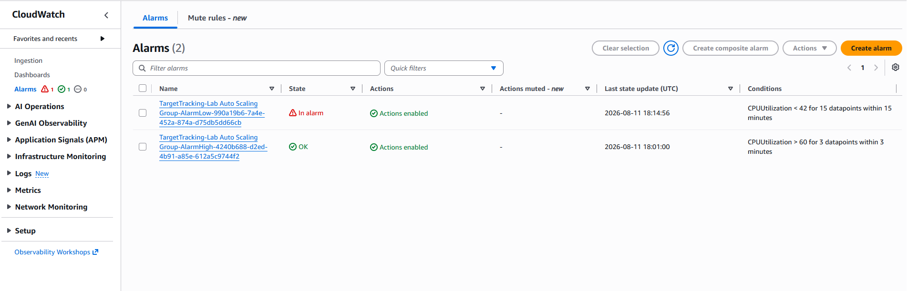
  <br/><em>Two alarms auto-created by the ASG — AlarmHigh (CPUUtilization > 60 for 3 datapoints) scales out, AlarmLow scales in.</em>
  <br/><br/>
  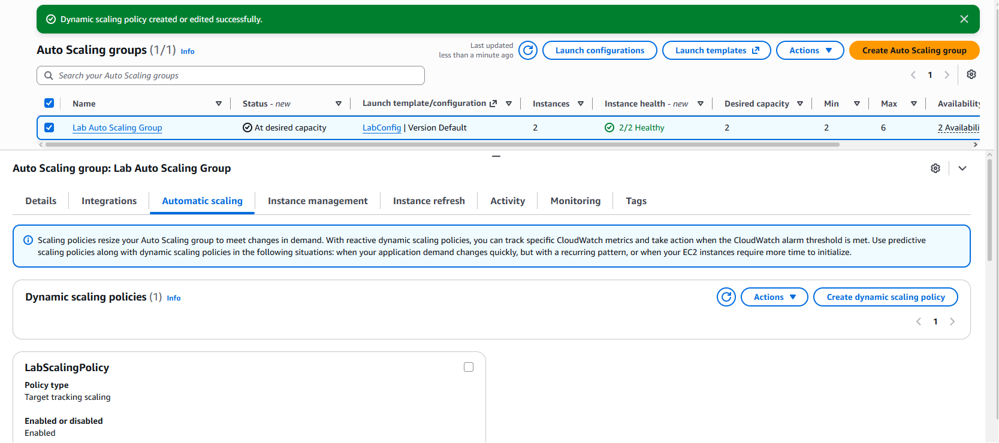
  <br/><em>LabScalingPolicy (target tracking, Enabled) — dynamic scaling policy edited to lower the target value so scale-out fires sooner.</em>
</div>

<div align="center">
  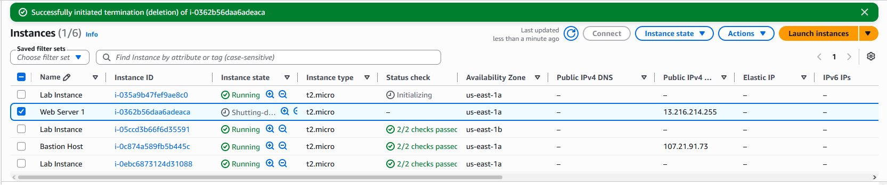
  <br/><em>Scale-out fired — a new Lab Instance (<code>i-035a9b47…</code>) is Initializing, taking the fleet above the original two (6 instances total). Auto Scaling launched it in response to AlarmHigh. (Web Server 1 shutting down here is Task 6.)</em>
</div>

### Task 6 — Terminate Web Server 1
The original server only existed to seed the AMI. Terminate it — the fleet is now defined entirely by the launch template and scaling policy.

<div align="center">
  
  <br/><em>"Successfully initiated termination of i-0362b56daa6adeaca" — Web Server 1 shutting down. The fleet now runs entirely from the LabConfig launch template + LabScalingPolicy.</em>
</div>

---

## Configuration Reference

| Resource | Type | Name / Value (exact) |
|---|---|---|
| AMI | Machine image | `WebServerAMI` |
| Target group | ELB target group | `LabGroup` |
| Load balancer | Application LB | `LabELB` |
| Launch template | Launch template | `LabConfig` |
| Instance type | EC2 size | `t2.micro` |
| Key pair | SSH key | `vockey` |
| Auto Scaling group | ASG | `Lab Auto Scaling Group` |
| Scaling policy | Target tracking | `LabScalingPolicy` |
| Target CPU | Metric target | `60% avg CPU` |
| Capacity | min / desired / max | `2 / 2 / 6` |
| Instance tag | Propagated tag | `Name = Lab Instance` |

---

## Key Takeaways

- **High availability by design** — an ALB across two AZs fronting an auto-scaled fleet removes the single point of failure; instance and AZ failures become non-events.
- **Reduced attack surface** — scaled instances stay in private subnets with no public IP; only the ALB security group faces the internet.
- **Immutable infrastructure** — every instance boots from the same AMI via the launch template: no config drift, clean rebuild path (terminate → Auto Scaling replaces).
- **Elasticity as a control** — target-tracking scaling is a closed feedback loop; the max cap prevents runaway cost from a load flood.
- **Health checks enforce integrity** — unhealthy targets are auto-removed from rotation without manual intervention.
- **Observability built in** — detailed monitoring + group metrics give per-minute fleet visibility, the same telemetry a SOC uses to spot anomalies.

---

## Lab Result

All six tasks graded and passed — **Total score: 35 / 35**.

<div align="center">
  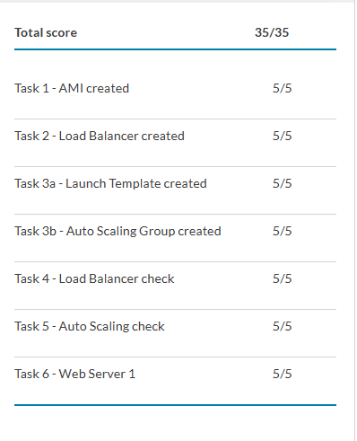
  <br/><em>AWS Academy submission report — full marks on AMI, Load Balancer, Launch Template, Auto Scaling Group, LB check, Auto Scaling check, and Web Server 1 termination.</em>
</div>

---

<div align="center">
<sub>

**Atif Memon** · [cloud-security-labs](https://github.com/atifkaloodi1/cloud-security-labs) · [gravatar.com/atifmem](https://gravatar.com/atifmem)

Part of the **CYB 222 — Linux Systems Administration & Security** AWS cloud module.

</sub>
</div>
